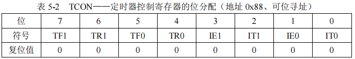
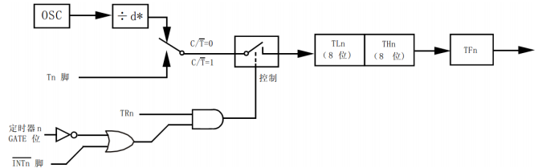
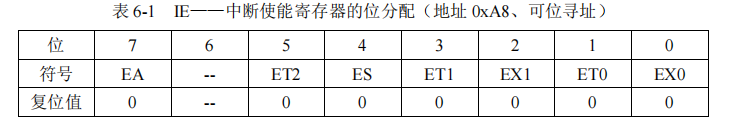
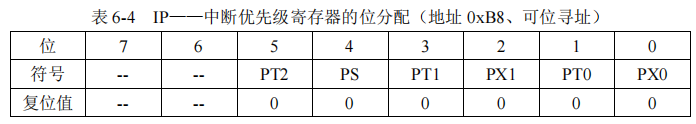
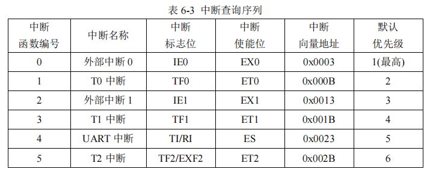

# C51 学习记录

## IO控制
- P0(addr: 0x80)
- P1(addr: 0x90)
- P2(addr: 0xA0)
- P3(addr: 0xB0)

## 定时器
- TCON(可位寻址)
  
- TMOD(不可位寻址)
  

  
定时器初值计算公式：晶振频率(OSC)、时钟周期(Tc)、机器周期(Tm)、 定时时间(t)、定时器初值(y)  
`Tc = (1/OSC)`;  
`Tm = 12*(1/OSC)`;  
`x*12*(1/OSC) = t`;  
`y = maxVal - x`;  
可位寻址/不可位寻址：能否单独对寄存器的某一位进行赋值操作

## 中断

中断函数中不要做耗时操作

- 中断优先级：
  - 抢占优先级：优先级高的中断可以打断优先级低的中断的执行。
  - 固有优先级：用于多个中断同时存在时的仲裁。

## 通信协议

- UART
- SPI
- IIC

## 按键
  - 具有上拉的准双向 IO 口，如果要正常读取外部信号的状态，必须首先得保证自己内部输出的是1
  - 通常检测按键的动作并不是检测一个固定的电平值，而是检测电平值的变化，即按键在按下和弹起这两种状态之间的变化，只要发生了这种变化就说明现在按键产生动作了

## LED流水灯

## LED点阵
  - LED点阵图形显示
  - LED点阵动态显示(纵向、横向移动)

## LED数码管

## LCD液晶显示

## 蜂鸣器模块

## 时钟模块

## 光敏模块

## 红外模块

## 温度检测模块

## EEPROM

## 电机控制

## 数模转换模块